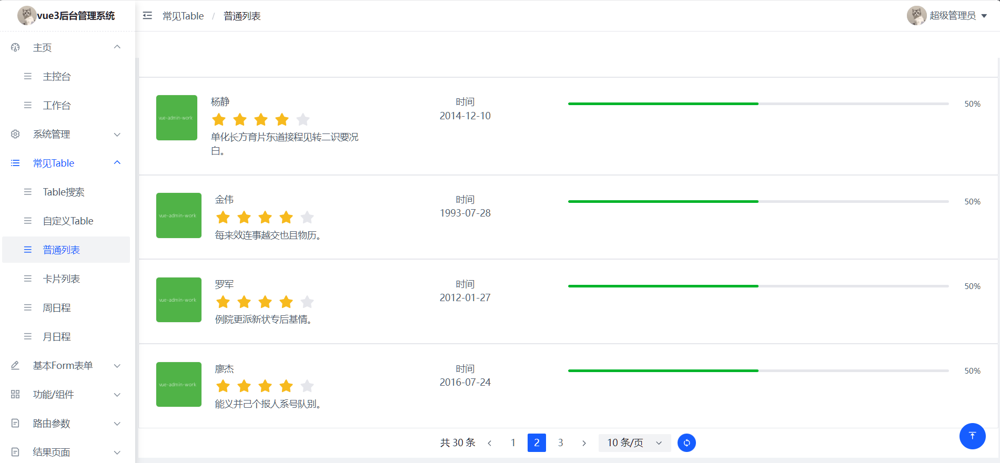
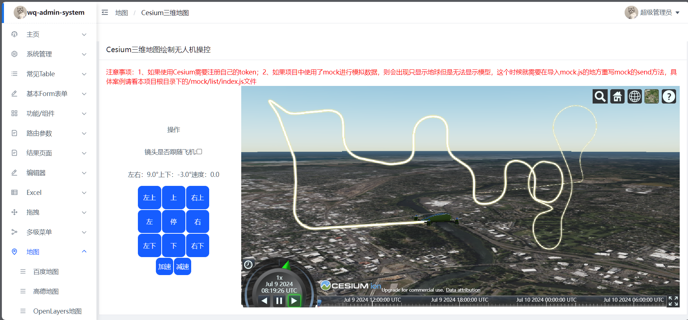

## 平台简介 admin-system 后台应用场景示例
admin-system是一个用于后台管理系统所有场景Demo展示的平台，是你在开发过程中遇到类似的场景，可在该平台寻找类似场景直接使用。方便快捷，减少开发时间

## 开始

* nodejs > 16.18.0 && pnpm > 8.6.0 (强制使用pnpm)

## 开发
* 安装依赖 pnpm install或pnpm i 也可以使用淘宝镜像下载  pnpm install --registry=https://registry.npm.taobao.org
* 启动项目 pnpm run dev

## 主页控制台

## 系统管理通用模块

## 常见列表组件

## 基本form组件

## 功能组件

## 编辑器

## 地图

## 部分功能还在完善中，有问题和需求都可以提issue，欢迎star和fork。谢谢